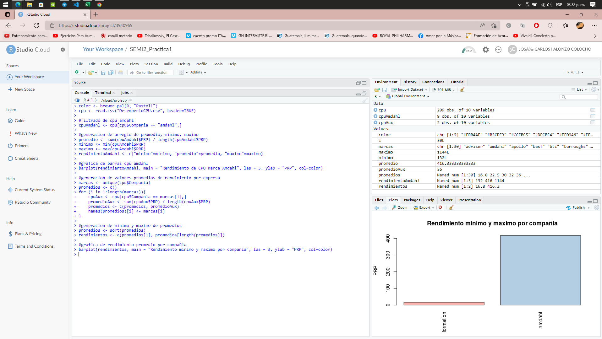

<p style="font-size: 18px">
Universidad de San Carlos de Guatemala
<br>
Facultad de Ingeniería
<br>
Escuela de Ciencias y Sistemas
<br>
Seminario de Sistemas 2
<br>
Ing. Luis Alberto Vettorazzi Espana
<br>
Aux. Gabriela Marilyn Orellana Solorzano
</p>

<br><br><br><br>


<h1 align="center" style="font-size: 40px; font-weight: bold;">Practica 1</h1>

<br><br><br>


<div align="center">

| Carnet | Nombre |
| :-: | :-:| 
| 201700965 | José Carlos I Alonzo Colocho |

</div>

<br><br>

<h4 align="center" style="font-size: 18px; font-weight: bold;">Guatemala 22 de Abril 2022</h4>


*** 


<br><br><br><br>

*** 

<h1>Tabla de Contenido</h1>

- [**1. Capturas**](#1-capturas)
- [**2. Scripts**](#2-scripts)

<br><br>

***
# **1. Capturas**

1.1. Ventas


<br>

1.2. CPU


<br>

1.3. Decesos


<br>

1.4. Presion


<br>

1.5. Pobreza


<br><br>

***
# **2. Scripts**

1.1. Ventas <br>

Primeramente se cargo el archivo csv, seguidamente se filtraron unicamente los paises soliciados pertenecientes a centroamerica, luego de ello fue generada la tabla de frecuencias y generados los graficos asociados a esta

```R
install.packages("RColorBrewer")
library("RColorBrewer")
color <- brewer.pal(9, "Pastel1")
ventas <- read.csv("VENTAS.csv", header=TRUE)

#filtrado de paises centroamericanos
ventasCA <- ventas[ventas$Country == "Guatemala" | ventas$Country == "Belice" | ventas$Country == "El Salvador" | ventas$Country == "Honduras" | ventas$Country == "Nicaragua" | ventas$Country == "Costa Rica" | ventas$Country == "Panama", ]

#generacion de tabla de frecuencias
frecuenciaAbsoluta <- table(ventasCA$Country)
frecuenciaAcumulada <- cumsum(frecuenciaAbsoluta)
frecuenciaRelativa <- prop.table(frecuenciaAbsoluta)
frecuenciaRelativaAcumulada <- cumsum(frecuenciaRelativa)
tablaDeFrecuencias <- cbind(frecuenciaAbsoluta, frecuenciaAcumulada, frecuenciaRelativa, frecuenciaRelativaAcumulada)
tablaDeFrecuencias <- data.frame(tablaDeFrecuencias)

#grafica de barras
barplot(frecuenciaAbsoluta, main = "Ventas por pais centroamericano", las = 3, ylab = "Ventas", col=color)

#histograma
hist(x = frecuenciaAcumulada, main = "Frecuencia Acumulada ventas por pais centroamericano", xlab = "Paises centroamericanos", ylab = "ventas", col=color)
```

<br>

1.2. CPU

Primeramente se cargo el archivo csv, luego de ello se filtraro los cpu fabricados por la compañia "amdahl", con esto se obtuvo el promedio, minimo y maximo en cuestion de rendimiento basandonos en la columna PRP, y se grafico dicha informacion; seguido de ello se obtuvieron todas las compañias de CPU existenes en el archivo y se itero sobre ellas para poder obtener el promedio de rendimiento de las mismas siempre basado en la columna PRP, luego de ello se ordeno y se obtuvo el valor minimo y  maximo para ser graficado

```R
install.packages("RColorBrewer")
library("RColorBrewer")
color <- brewer.pal(9, "Pastel1")
cpu <- read.csv("DesempenioCPU.csv", header=TRUE)

#filtrado de cpu amdahl
cpuAmdahl <- cpu[cpu$Compania == "amdahl",]

#generacion de arreglo de promedio, minimo, maximo
promedio <- sum(cpuAmdahl$PRP) / length(cpuAmdahl$PRP)
minimo <- min(cpuAmdahl$PRP)
maximo <- max(cpuAmdahl$PRP)
rendimientoAmdahl <- c("minimo"=minimo, "promedio"=promedio, "maximo"=maximo)

#grafica de barras cpu amdahl
barplot(rendimientoAmdahl, main = "Rendimiento de CPU marca Amdahl", las = 3, ylab = "PRP", col=color)

#generacion de valores promedios de rendimiento por empresa
marcas <- unique(cpu$Compania)
promedios <- c()
for (i in 1:length(marcas)){
    cpuAux <- cpu[cpu$Compania == marcas[i],]
    promedioAux <- sum(cpuAux$PRP) / length(cpuAux$PRP)
    promedios <- c(promedios, promedioAux)
    names(promedios)[i] <- marcas[i]
}

#generacion de minimo y maximo de promedios
promedios <- sort(promedios)
rendimientos <- c(promedios[1], promedios[length(promedios)])

#grafica de rendimiento promedio por compañia
barplot(rendimientos, main = "Rendimiento minimo y maximo por compañia", las = 3, ylab = "PRP", col=color)
```


<br>

1.3. Decesos

Para este se cargo el csv y se filtro tomando en cuenta unicamente los registros en los cuales el sexo y la edad fueran diferentes de la palabra "Total", seguido de ello se formo una tabla de frecuencias y con ello la creación de los graficos asociados a la misma.

```R
install.packages("RColorBrewer")
library("RColorBrewer")
color <- brewer.pal(9, "Pastel1")
muertes <- read.csv("MuertesSexoEdad.csv", header=TRUE)

#aplicando filtro
muertes <- muertes[muertes$Age != "Total" ,]
muertes <- muertes[muertes$Sex != "Total" ,]

#creacion de tabla de frecuencias
frecuenciaAbsoluta <- table(muertes$Age)
frecuenciaAcumulada <- cumsum(frecuenciaAbsoluta)
frecuenciaRelativa <- prop.table(frecuenciaAbsoluta)
frecuenciaRelativaAcumulada <- cumsum(frecuenciaRelativa)
tablaDeFrecuencias <- cbind(frecuenciaAbsoluta, frecuenciaAcumulada, frecuenciaRelativa, frecuenciaRelativaAcumulada)
tablaDeFrecuencias <- data.frame(tablaDeFrecuencias)

#histograma
hist(x = frecuenciaAbsoluta, main = "Frecuencia absoluta de decesos por edad", xlab = "Edades", ylab = "Decesos", col=color)

#poligono de frecuencias
polygon(x=frecuenciaAbsoluta)

#diagrama frecuencia acumulada
hist(x = frecuenciaAcumulada, main = "Frecuencia Acumulada de decesos por edad", xlab = "Edades", ylab = "Decesos", col=color)
```


<br>

1.4. Presion

Para este fue cargado el archivo csv, y se procedio graficar las relaciones entre las columnas y verificar los indices de correlación, al ser diferente de cero si puede existir una regresion lineal con lo cual se realizo y se grafico, con los datos obtenidos en la regresion se puede generar la función que puede brindarnos valores que podrian ser utilizados para predecir los datos futuros

```R
install.packages("RColorBrewer")
library("RColorBrewer")
color <- brewer.pal(9, "Pastel1")
presion <- read.csv("PresionSanguineaEdad.csv", header=TRUE)

#exploración de datos
pairs(presion)
cor(presion)

#regresion lineal
regresion = lm(presion$Systolic.Blood.Pressure  ~ presion$Edad)
plot(presion$Edad, presion$Systolic.Blood.Pressure, main="relacion edad - presion", xlab="edad", ylab="presion")
abline(regresion, col="red")

#verificacion
verificacion = function(edad) {
    98.7147 + 0.9709 * edad
}

```


<br>

1.5. Pobreza

Para este fue cargado el archivo csv, y se procedio graficar las relaciones entre las columnas y verificar los indices de correlación, al ser diferente de cero si puede existir una regresion lineal con lo cual se realizo y se grafico, con los datos obtenidos en la regresion se puede generar la función que puede brindarnos valores que podrian ser utilizados para predecir los datos futuros

```R
install.packages("RColorBrewer")
library("RColorBrewer")
color <- brewer.pal(9, "Pastel1")
pobreza <- read.csv("PobrezaDesempleoAsesinatos.csv", header=TRUE)

#exploración de datos
pairs(pobreza)
cor(pobreza)

#regresion lineal pobreza - desempleo
regresionPobrezaDesempleo = lm(pobreza$Porcentaje.desempleado ~ pobreza$Porcentaje.con.ingresos.debajo.de.5000)
plot(pobreza$Porcentaje.con.ingresos.debajo.de.5000, pobreza$Porcentaje.desempleado, main = "relacion pobreza - desempleo", xlab="pobreza", ylab="desempleo")
abline(regresionPobrezaDesempleo, col="red")

#verificacion pobreza - desempleo
pobrezaDesempleo = function(desempleo) {
    0.9486 + 0.3036 * desempleo
}

#regresion lineal pobreza - asesinatos
regresionPobrezaAsesinatos = lm(pobreza$Asesinatos.por.1000000.habitantes ~ pobreza$Porcentaje.con.ingresos.debajo.de.5000)
plot(pobreza$Porcentaje.con.ingresos.debajo.de.5000, pobreza$Asesinatos.por.1000000.habitantes, main = "relacion pobreza - asesinatos", xlab="pobreza", ylab="asesinatos")
abline(regresionPobrezaAsesinatos, col="red")

#verificacion pobreza - asesinatos
pobrezaAsesinatos = function(asesinatos) {
    -29.901 + 2.559 * asesinatos
}
```